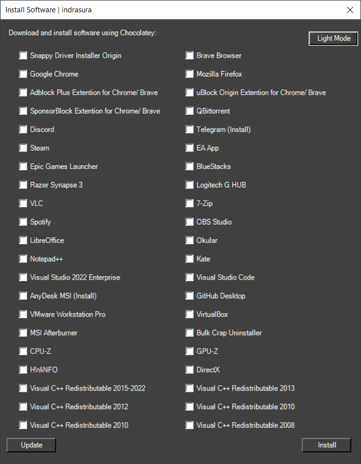

# 1Tool

1Tool is a convenient and straightforward PowerShell script designed for individuals who frequently perform clean installations of Windows or utilize virtualization tools such as shadow or VM. It leverages the power of Chocolatey, a fast, easy, and secure package manager for Windows, similar to package managers found in Linux distributions. With 1Tool, you can effortlessly install, upgrade, or uninstall a wide range of listed applications, saving you valuable time. It provides the flexibility to customize the script according to your specific requirements.

Chocolatey is a package manager for Windows that allows you to easily install, upgrade, and uninstall software packages from the command line. It provides a centralized repository of packages, making it convenient to manage and maintain your software installations.

To use the 1Tool, you need to have Chocolatey Package Manager installed. If you're using the 1Tool, it will automatically install Chocolatey for you, so there's no need to install it manually.



## Installation

To install Chocolatey Package Manager manually, follow these steps:

Open a command prompt or PowerShell window with administrative privileges.

Run the following command to set the execution policy:
```bash
Set-ExecutionPolicy Bypass -Scope Process -Force; [System.Net.ServicePointManager]::SecurityProtocol = [System.Net.ServicePointManager]::SecurityProtocol -bor 3072; iex ((New-Object System.Net.WebClient).DownloadString('https://community.chocolatey.org/install.ps1'))
```
Note: After the installation is complete, you should close the PowerShell window.

**Install Directory of chocolatey:** `C:\ProgramData\chocolatey`

**Package library:** `C:\ProgramData\chocolatey\lib`

## Usage

**Install Button: The Install button in the 1Tool will will install all the selected packages and any required dependencies.**
**Update Button: The Update button in the 1Tool will check all the software installed via Chocolatey and update them to the latest versions with just one click.**

The 1Tool provides several useful commands and features for managing software packages using Chocolatey. Here are some common commands and examples:
- Package Search: You can search for available packages on the Chocolatey community website at https://community.chocolatey.org/packages.

- Common Commands (Install, Upgrade, Uninstall): You can use the following commands to perform common operations:
    - Install a package: Example: choco install googlechrome
    ```bash
    choco install {package_name}
    ```
    - Upgrade a package:
    ```bash
    choco upgrade {package_name}
    ```
    - Uninstall a package:
    ```bash
    choco uninstall {package_name}
    ```
    - Multi Package Installer: You can install multiple packages at once by listing them all in the install command: Example: choco install googlechrome vscode putty 7zip
    ```bash
    choco install {package1} {package2} {package3} ...
    ```
    - Update all packages at once: You can update all installed packages to their latest versions using the following command:
    ```bash
    choco upgrade all -y
    ```

## Troubleshooting
If a package is not installing or you have uninstalled the software using a different program (such as Revo Uninstaller or Control Panel), you can follow these steps to resolve the issue:

Check the library directory of Chocolatey (C:\ProgramData\chocolatey\lib) to see if the package is still present.
Open a PowerShell window with administrative privileges and uninstall the package using Chocolatey again "choco uninstall {package_name}"
This will remove the package from the Chocolatey library, allowing you to reinstall it.

## Contributing

Contributions to 1Tool are welcome! To contribute, fork the repository, make your desired changes, and submit a pull request. Your contributions are greatly appreciated!

## License

[MIT](https://choosealicense.com/licenses/mit/)